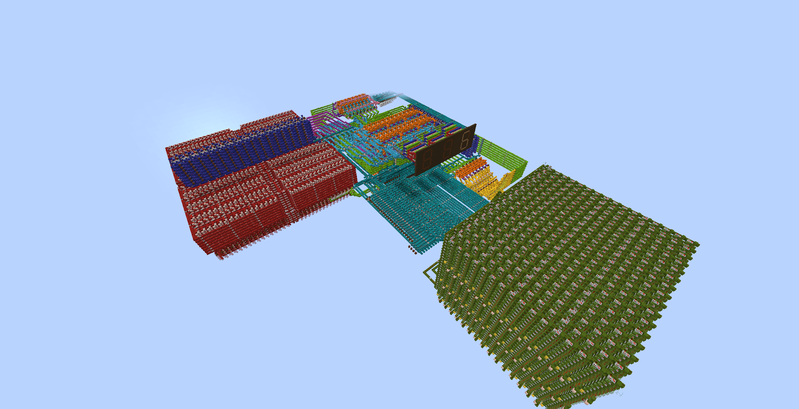

# Minecraft CPU

This is an 8-bit CPU built inside Minecraft. All of the hardware is entirely made through redstone. 

## How it works
Using the WorldEdit mod, I can paste a schematic file into Minecraft. A schematic file essentially contains data to paste a structure into your Minecraft world. The compiler for this project generates a schematic file for me to paste into my instruction ROM. It compiles a custom assembly code, converts it to binary, then outputs the schematic file.

## What is redstone?
Redstone is Minecraft's system for building logic and contraptions. You can create individual wires that can turn on or off. You can link together signals for an AND gate and you can invert a signal to create a NOT gate. And there are components that allow you to delay a signal from a wire. Turns out, this is all you need to create a Turing complete computer. By building simple components and copying/pasting them, I can create complex hardware, and I can build up until I create a computer. I designed every component in this computer from scratch, except for a binary adder which is used in many components. I built my own binary adder, but I adopted to use a fast and compact one I found online.

## Current Features
Currently, my CPU supports the following features
- **ALU** -  An ALU that can perform bitwise operations as well as addition and subtraction
- **Register file** - A 16-byte dual-read register file
- **Instruction ROM** - A ROM capable of holding 256 instructions
- **Program counter** - A program counter which controls where I am in the program
- **Clock** - This computer uses a 0.1 Hz clock cycle (very fast, I know)
- **Jumping/branching** - Supports conditional logic and loops using flags set by the ALU
- **Function calls** - Supports function calls with a max-depth of 16
- **RAM** - 256 bytes of RAM
- **Pointers** - The ability to store and dereference pointers
- **Display** - A 3-digit seven-segment display, using a double-dabble chip to display any 8-bit number
- **Debug Output** - A stack to store history of displayed digits, allowing me to debug tests
- **Instruction Decoding** - Decodes instructions to activate certain options within the CPU
- **Assembly Language** - A special assembly language with a baked-in compile-time language

## Planned Features 
- **Screen** - A 32 x 32 pixel screen. I have already built a graphics-accelerator that is capable of quickly rendering a line between two points. I will also have the ability to plot single pixels.
- **Signed integers** - Support operations for comparing and displaying signed integers
- **Multiplication and Division** - I have already made chips for multiplication and division, I just need to connect them to the CPU
- **Memory regions** - A stack and a heap to more efficiently manage memory
- **Expanded Instruction ROM** - Expand instruction ROM to hold 1024 individual instructions
- **Function pointers** - The ability to store and call functions with pointers. This will require a few unique tricks because my ROM will store more than than 256 individual instructions, so I need more that 8 bits to store a memory address.
- **Controller** - A simple controller for games
- **Emulator** - An web-based emulator for my Minecraft CPU, showing a demo of what my Minecraft computer is capable of
- **Higher Level Programming Language** - A C-like programming language that compiles to my Minecraft machine code. This is the end goal of my project; to write and debug code using my emulator and then run on my Minecraft CPU
